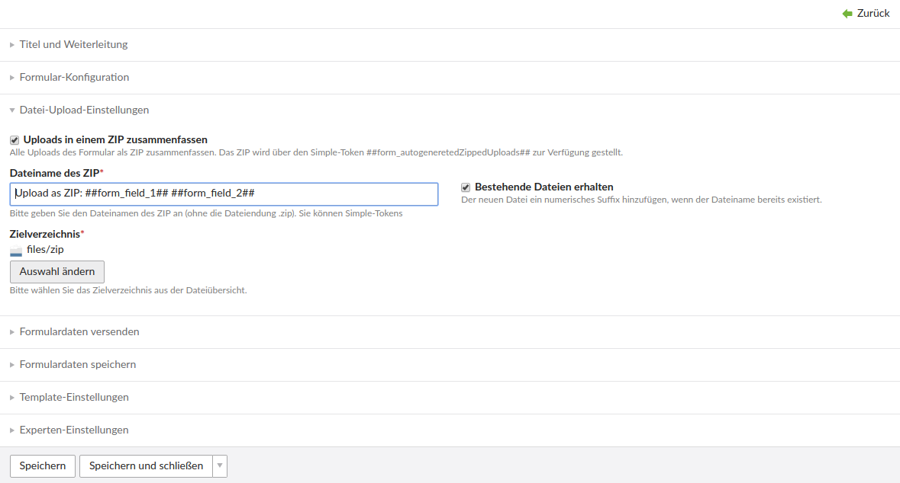
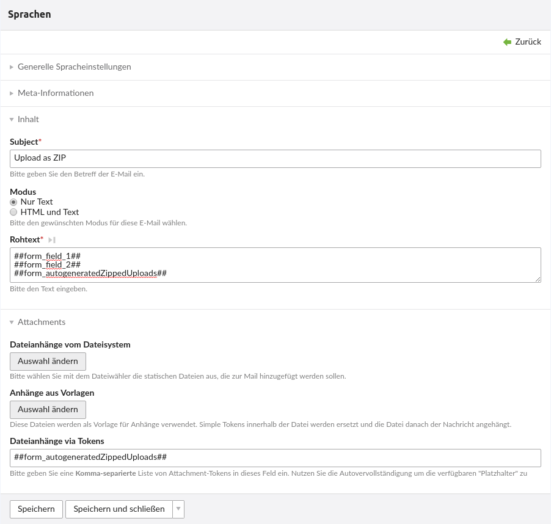

Zipuploads bundle
==================

With the Zipuploads bundle it is possible to put all the uploaded files of a form into a single ZIP. It does not matter if it's the Contao Standard Uploader or the fineuploader by terminal42 (https://github.com/terminal42/contao-fineuploader). The upload fields themselves do not have to be updated and configured in addition.

The Zipuploads bundle adds "file upload settings" to the form properties. There is then the option "summarize uploads in a ZIP". If this is set, the file name and storage location can be determined. The file name can be customized using simple tokens.

Various simple tokens are available for this purpose:
   
    ##rand##: Random string via PHP function "uniqid('', true)"  
    ##date##: current date analogous to Contao settings  
    ##time##: current time analogous to Contao settings  
    ##datim##: current date and time analogous to Contao settings  
    as well as all form fields through ##form_*##  
If the option "Get existing files" is set, a suffix will be added to the ZIP file, similar to the Contao core functionality.

The ZIP is then available as a simple token, e.g. available in the Notification Center at 

    ##form_autogeneretedZippedUploads##.

This allows the file path and name of the ZIP to be output in a notification or the ZIP in question to be attached to the e-mail.

Zipuploads Bundle
==================

Mit dem Zipuploads Bundle ist es möglich, alle hochgeladenen Dateien eines Formulares in ein einzelnes ZIP zu packen. Dabei ist es egal, ob es der Contao-Standard-Uploader oder der fineuploader von terminal42 (https://github.com/terminal42/contao-fineuploader) ist. Die Upload-Felder selbst müssen nicht angepasst und ergänzend konfiguriert werden.

Mit dem Zipuploads Bundle werden "Datei-Upload-Einstellungen" zu den Formular-Eigenschaften hinzugefügt. Dort gibt es dann die Option "Uploads in einem ZIP zusammenfassen". Ist diese gesetzt, können Dateiname und Ablageort bestimmt werden. Der Dateiname kann über Simple-Tokens individualisiert werden.

Hierzu stehen verschiedene Simple-Tokens zur Verfügung:

    ##rand##: Zufälliger String via PHP-Funktion "uniqid('', true)"  
    ##date##: aktuelles Datum analog Contao-Einstellungen  
    ##time##: aktuelle Uhrzeit analog Contao-Einstellungen  
    ##datim##: aktuelles Datum und Uhrzeit analog Contao-Einstellungen  
    sowie alle Formularfelder über ##form_*##  
Ist die Option "Bestehende Dateien erhalten" gesetzt, wird an die ZIP-Datei ein Suffix analog der Contao-Core-Funktionalität gehängt.

Das ZIP steht im Anschluss als Simple-Token z.B. im Notification-Center zur Verfügung unter

    ##form_autogeneratedZippedUploads##.

Damit kann der Dateipfad und -Name des ZIP in einer Benachrichtigung ausgegeben werden bzw. das fragliche ZIP an die E-Mail angehängt werden.

Screenshots
===========

Formular-Eigenschaften

Notification-Center

Installation
============

Install the extension via composer: [trilobit-gmbh/contao-zipuploads-bundle](https://packagist.org/packages/trilobit-gmbh/contao-zipuploads-bundle).  
And update your database.

Compatibility
=============

* Contao version ~4.4
* Contao version ~4.9
* PHP version ~7.2
* PHP version ~7.3
